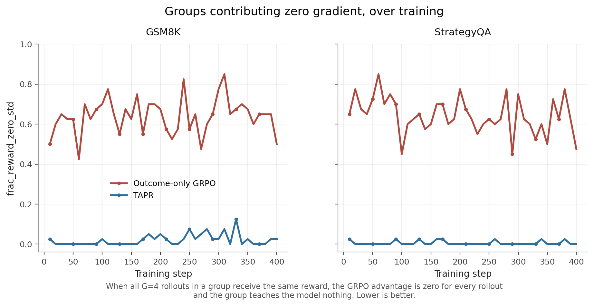

# TAPR — Transition-Aware Process Reward

**Dense reward signal for GRPO fine-tuning of small language models, via live judging of step-to-step reasoning transitions.**

Work by Harsh Raj, Ramaiah Institute of Technology, Bangalore.

---

## The problem

GRPO computes advantages by comparing rollouts within a group:

```
A_i = (R_i − mean(R₁…R_G)) / std(R₁…R_G)
```

When every rollout in a group receives the same reward — all correct, or all wrong — the standard deviation is zero, so `A_i = 0` for every rollout and the group contributes **no gradient at all**. The model learns nothing from that problem.

This is not rare. Measured on Qwen2.5-3B:

| Task | Groups with zero reward variance (outcome-only GRPO) |
|---|---|
| GSM8K | **52.5%** |
| StrategyQA | **62.5%** |

Outcome-only GRPO is blind on the majority of its training data. Easy problems (all rollouts succeed) and hard problems (all rollouts fail) both collapse to zero signal. Only problems in the narrow band where some rollouts succeed and some fail contribute anything.

## The idea

Even when four rollouts land on the same final answer, the *quality of the reasoning that got there* differs. A chain that guessed correctly and a chain that reasoned correctly both receive `R_outcome = 1`, but they are not the same.

TAPR adds a second reward term that scores step-to-step transitions:

```
R_total = R_outcome + λ · R_transition
```

`R_transition` is produced by a frozen judge model scoring sliding windows of consecutive reasoning steps — asking not "is the answer right?" but "does each step follow from the one before it?" These two signals are orthogonal, and that orthogonality is what restores within-group variance.

**One structural constraint:** the judge must run *live during training*. Pre-computing transition scores per problem gives every rollout in a group the same score, so within-group variance stays zero and the degeneracy is unsolved. Live scoring is architecturally required, not merely convenient. ([derivation](docs/RESEARCH_RECORD.md#the-live-scoring-requirement--formal-argument))

---

## Results

Qwen2.5-3B-Instruct student · Qwen2.5-7B-Instruct judge · GRPO + LoRA (r=16) · 400 steps · single A100-40GB.

### 1. TAPR eliminates reward degeneracy



| Task | Outcome-only GRPO | TAPR |
|---|---|---|
| GSM8K | 0.525 | **0.000** |
| StrategyQA | 0.625 | **0.003** |

Effective training data goes from ~47% of problems to ~100%. The same pattern holds across two structurally different tasks, which suggests the mechanism is task-agnostic. This result is definitional rather than correlational — zero within-group variance mathematically implies zero advantage.

### 2. Cross-task transfer: the headline finding

GSM8K-trained models evaluated on StrategyQA. Neither model saw a single StrategyQA example during training.

| Model | StrategyQA | vs. untrained |
|---|---|---|
| Zero-shot (untrained) | 61.0% | — |
| Outcome-only GRPO | 55.5% | **−5.5pp** |
| TAPR | 60.0% | **−1.0pp** |
| | | **gap: 4.5pp** |

Outcome-only GRPO on GSM8K *damaged* the model's general reasoning — 5.5pp below the untrained baseline. TAPR lost only 1.0pp. The proposed mechanism: ORM optimizes for format compliance (numbered steps ending in `####`), driving catastrophic over-specialization, while TAPR optimizes for step-to-step logical validity, a more transferable property.

**This is a single-seed result.** Multi-seed replication is the top-priority next experiment.

### 3. In-domain accuracy

| Benchmark | Zero-shot | Outcome-only | TAPR | TAPR vs. ORM |
|---|---|---|---|---|
| GSM8K (n=1319) | 72.86% | 77.03% | 77.26% | +0.23pp |
| StrategyQA (n=200) | 61.00% | 62.50% | 63.50% | +1.00pp |
| MATH-500 (n=200) | 47.00% | ~47% | ~47% | ~0pp |

**These in-domain gaps are not claimable improvements.** +0.23pp on GSM8K is three additional correct answers out of 1319 — noise. +1.00pp on StrategyQA sits well inside the 3.4pp standard error at n=200. MATH-500 is a clean null result: GSM8K training does not transfer to competition math, which usefully bounds the transfer effect.

A cautionary note worth recording: at n=200, the GSM8K TAPR-vs-ORM gap read as **3.0pp**. At the full 1319 problems it collapsed to **0.23pp**. Small-sample RL evaluation is unstable.

### 4. Judge validation

| Task | Judge | n | Spearman r | 95% CI | Separation | Status |
|---|---|---|---|---|---|---|
| GSM8K | GPT-4.1-mini | 93 | 0.600 | [0.45, 0.72] | 90.3% (84/93) | early reference |
| GSM8K | Qwen2.5-7B-Instruct | 20 | **0.734** | [0.43, 0.89] | **95% (19/20)** | production |
| StrategyQA | Qwen2.5-7B-Instruct | 20 | 0.531 | [0.12, 0.79] | 85% (17/20) | production |
| StrategyQA | Qwen2.5-32B-Instruct | 20 | 0.388 | [−0.07, 0.71] | 70% (14/20) | rejected |
| MATH | Qwen2.5-7B-Instruct | 20 | 0.081 | — | 50% (10/20) | failed |
| MATH | Qwen2.5-Math-7B-Instruct | 20 | — | — | 0% (0/20) | failed |
| MATH | Qwen2.5-32B-Instruct | 20 | 0.223 | — | 40% (8/20) | failed |

**Read the n column before the r column.** Every calibration run except the GPT-4.1-mini reference used n=20, and the resulting intervals are wide enough to swallow most of the comparisons anyone would want to make:

- **The open-weight 7B judge is competitive with GPT-4.1-mini, not demonstrably better.** 0.734 vs. 0.600 looks decisive, but [0.43, 0.89] against [0.45, 0.72] is almost complete overlap, and the separation rates overlap too (19/20 → [0.76, 0.99] vs. 84/93 → [0.83, 0.95]). What the result does support: an open-weight judge performs well enough to remove the closed-weight API dependency. Establishing that it *beats* GPT-4.1-mini needs roughly n=80.
- **"Bigger is not better" is suggestive, not established.** 32B scored below 7B on StrategyQA on both metrics, but at n=20 those intervals overlap heavily. It was enough to justify not paying for the 32B judge; it is not a finding about scale.

The MATH failures are the exception — 0/20 and 10/20 separation are far enough from chance-adjusted expectations that small n doesn't rescue them, and the diagnosis is mechanistic rather than statistical (see below).

---

## What didn't work

**MATH training was abandoned.** All three candidate judges failed, each differently:

- **Qwen2.5-7B** — r=0.081, no statistical signal.
- **Qwen2.5-Math-7B** — total format collapse. The model ignores the SCORE instruction and emits its own solution instead ("*To evaluate the quality of the step-by-step reasoning, let's analyze each step carefully...*"). A constraining system prompt had no effect; its math-solving instruction tuning overrides any grader role. Every window fell back to the neutral 0.5 default, so correct and flawed chains scored identically and separation was 0/20.
- **Qwen2.5-32B** — format compliance was perfect, but the algebraic dimension separated 0/7.

The diagnostic pattern is consistent across all three: the **relevance** dimension separates well (4–5 out of 6), while the **algebraic validity** dimension does not (0–2 out of 7). Relevance is checkable by reading; algebraic validity requires independently solving the problem. No open-weight model at 7B–32B scale does the latter reliably for competition math. This is a capability ceiling, not a prompt-engineering problem.

**MMLU was never evaluated.** Multiple-choice knowledge retrieval is a poor fit for a method that scores reasoning transitions — short answers yield too few windows for the signal to exist.

---

## Repository layout

```
├── src/
│   ├── train_grpo.py                    # GRPO training: --task {gsm8k,strategyqa,math} --mode {baseline,tapr}
│   ├── eval.py                          # Standalone eval across GSM8K / MATH-500 / StrategyQA
│   ├── judge_validation_strategyqa.py   # StrategyQA judge calibration
│   ├── judge_validation_math.py         # MATH judge calibration (documents the failure)
│   └── plot_training_curves.py          # Regenerates docs/figures/ from runs/ — no GPU needed
├── runs/                                # The four 400-step runs behind every number in this README
│   ├── gsm8k_tapr/                      # adapter/ + run_summary.json + training_log.json
│   ├── gsm8k_baseline/
│   ├── sqa_tapr/
│   └── sqa_baseline/
├── results/
│   ├── reward_degeneracy.json           # The core mechanistic result
│   ├── gsm8k/full_eval_summary.json     # Full 1319-problem test split
│   ├── strategyqa/eval_summary.json     # Trained + cross-task transfer
│   ├── math500/eval_summary.json        # Null result
│   └── judge_validation/
│       ├── summary.json                 # All seven judge calibration runs
│       ├── strategyqa_judge_validation.json  # Per-problem scores, production judge
│       └── math_judge_validation.json        # Per-problem scores, the 32B failure
├── docs/
│   ├── RESEARCH_RECORD.md               # Full theory, derivations, every decision and tradeoff
│   ├── FUTURE_WORK.md                   # Planned follow-on experiments — nothing here has been run
│   └── figures/                         # Generated by src/plot_training_curves.py, PNG + SVG
├── index.html                           # Standalone project page (src/build_page.py)
└── requirements.txt
```

Every results file carries a `provenance` field marking whether figures are exact transcriptions from run logs or approximate. Two MATH-500 figures are marked approximate and must be re-run before any submission.

`runs/` holds the trained LoRA adapters and the per-step TRL training logs — see [runs/README.md](runs/README.md). Intermediate checkpoints (steps 100–400) are not kept in the repo; the metrics they carried were extracted into each run's `training_log.json` first.

---

## Reproducing

```bash
pip install -r requirements.txt
```

Requires a single A100-40GB (or equivalent). 4-bit quantized: 3B student ≈ 2.7GB, 7B judge ≈ 5.6GB.

**Validate the judge before training anything.** A judge that cannot separate correct from flawed reasoning produces noise, not signal.

```bash
python src/judge_validation_strategyqa.py --output_file results/sqa_judge.json
```

**Smoke test before every full run** (5 steps, 20 problems, ~5 min — catches format and reward-path errors):

```bash
python src/train_grpo.py --task gsm8k --mode tapr --smoke_test --output_dir /tmp/smoke
```

**Train** (~7h for 400 steps on A100):

```bash
# Outcome-only baseline
python src/train_grpo.py --task gsm8k --mode baseline \
  --output_dir ./runs/gsm8k_baseline

# TAPR
python src/train_grpo.py --task gsm8k --mode tapr --lambda_val 0.3 \
  --output_dir ./runs/gsm8k_tapr
```

**Evaluate** — either a run you just trained, or the adapters shipped in `runs/`:

```bash
python src/eval.py --model tapr \
  --tapr_dir ./runs/gsm8k_tapr/adapter \
  --output_file results/eval_tapr.json
```

### Configuration

| | |
|---|---|
| Student | Qwen2.5-3B-Instruct (4-bit) |
| Judge | Qwen2.5-7B-Instruct (4-bit, frozen) |
| LoRA | r=16, α=32, targets q/k/v/o_proj |
| GRPO | G=4, β(KL)=0.1, lr=1e-5, 400 steps |
| λ | 0.3 |
| Windows | sizes {2,3,5}, P=(0.1, 0.5, 0.4) |

**Implementation note:** batching every window judge call for a training step into a single `model.generate()` gave an **11.6× speedup** (772s → 67s per step), which is what made 400-step training feasible at all. This requires `padding_side="left"` so sequences align at the generation start — without it, attention patterns break and judge outputs become garbage.

---

## Honest limitations

- **3B student, 400 steps.** KL stayed at 0.001–0.004 throughout — the policy barely moved. This is enough to demonstrate the mechanism, not enough to demonstrate accuracy gains.
- **Single seed everywhere.** The 4.5pp cross-task result could be noise until replicated.
- **StrategyQA has no labeled test set.** Evaluation uses a held-out 10% of the train split. Both runs share `RANDOM_SEED=42`, so the eval sets are identical across conditions.
- **n=200 for StrategyQA and MATH-500.** Standard error ≈ 3.4pp.
- **λ=0.3 was tuned qualitatively during early exploration**, never formally ablated at full training scale.
- **The transfer mechanism is a hypothesis.** Two explanations remain live: TAPR as implicit regularizer (moves the policy less) versus TAPR as different learning (moves it comparably but in a different direction). The policy drift experiment is designed to distinguish them.

---

## What's next

The framing has shifted from *"TAPR improves benchmark accuracy"* — which 3B at 400 steps does not support — to a mechanistic question:

> **Does transition-aware reward shaping change what reasoning policies learn, even when in-domain accuracy stays similar?**

The follow-on experiments this implies — multi-seed replication, policy drift analysis, reward ablation, transfer characterization — are specified in [docs/FUTURE_WORK.md](docs/FUTURE_WORK.md). **None of them have been run.** This repository contains completed work only: everything reported above was measured.

---

## Author

**Harsh Raj** — B.E. Computer Science, Ramaiah Institute of Technology, Bangalore

## License

MIT

## Acknowledgements

Built on [TRL](https://github.com/huggingface/trl), [PEFT](https://github.com/huggingface/peft), and [Qwen2.5](https://github.com/QwenLM/Qwen2.5). GRPO is from [DeepSeekMath](https://arxiv.org/abs/2402.03300). Process-reward framing draws on [Lightman et al., 2023](https://arxiv.org/abs/2305.20050).
